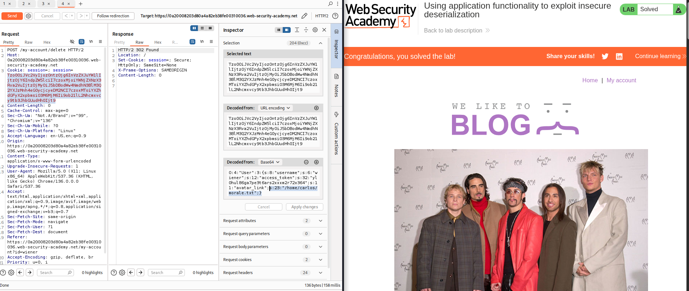
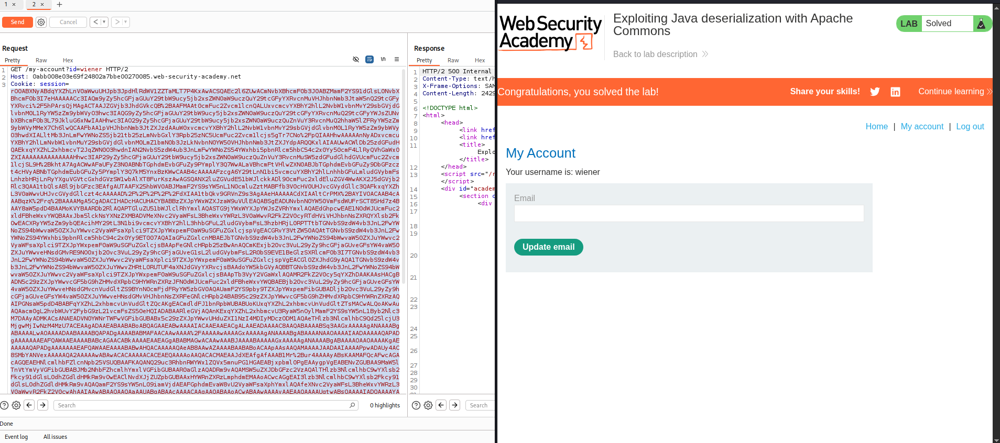
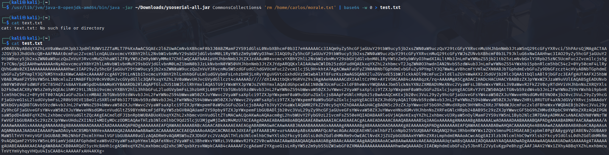

Лаба 1 - https://portswigger.net/web-security/deserialization/exploiting/lab-deserialization-using-application-functionality-to-exploit-insecure-deserialization

Підсвітив кукі які я використав, та що там буду у правій частині скріншоту

Лаба 2 - https://portswigger.net/web-security/deserialization/exploiting/lab-deserialization-exploiting-java-deserialization-with-apache-commons

ці кукі були створені за допомогою ysoseria

Лаба 2 - https://www.root-me.org/en/Challenges/Web-Server/PHP-Serialization

Не розумію чому, пробився над задачею дуже багато часу. Я розумію що куку таке як правильно зробив, але не виходить. Навіть знайшов корейця який веде свій блог і проходив цю таску, перевів і все одно кука та ж, але на прапор не можу вийти. Ну і в Слак казали про таке ж виріщення